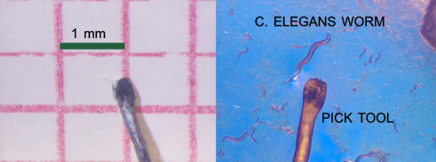
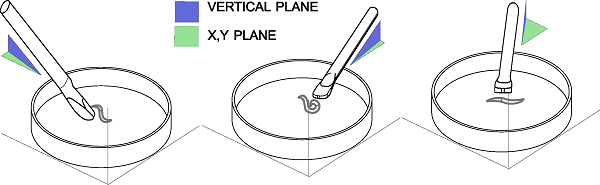
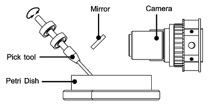

# worm-pick-assistant
Real-time C. elegans motion tracking and pick-tool angle estimation using embedded machine learning. Designed for microscopy workflows and automated worm handling on Raspberry Pi with Edge Impulse.

---
## Introduction

In many research laboratories one of the most essential items, beyond microscopes and imaging equipment, is the set of manual tools used to manipulate biological samples. In the case of C. elegans worms, the pick tool used to transfer specimens from plate to plate is often handmade, highly customized, and adapted to each researcher’s personal technique.
The goal of this project is to assist both the detection and handling of these specimens through an AI-driven system capable of tracking the worms, recognizing the user’s pick-tool shape and providing the best orientation of the tool beside the selected specimen. The system provides real-time visual guidance that improves accuracy and speed while minimizing the risk of wounds to the specimens and avoiding the agar surface damage, thereby enhancing reproducibility when manipulating worms on culture plates. 

## Project overview.

For this case, the pick tool is a 0.3 mm diameter platinum wire. The tip was pressed with pliers to form a flat end. Other possible tip configurations include a semi-loop and other variations of these shapes created by bending the wire.
The single-wire flat tip has the disadvantage of having a small contact area, making it more difficult to overcome the surface tension of the medium in the plate compared to the semi-loop shape. Nevertheless, the flat tip has the advantage of carrying less material and reducing the probability of causing wounds to the specimens and allowing the specimen to more easily separate from the pick when it is released, the common technic requires a downward pressure with a forward stroke. That motion slightly squeezed the specimen and immersed them into the medium mass.  

## Determination of the motion phases

For acquiring the dataset images, the different positions had to be created by hand-made motions, and the dataset includes only the positions from the lifting phase corresponding to successful trials. The pick tool has two principal rotational degrees of freedom. The tip of the pick tool needs to remain within the camera’s depth of field that at high magnification has less deep of field, while the rest of the pick body appears out of focus at higher angles due to the magnification required to visualize the worms. This must be considered in the vision model.

## Basic mechanic setup
For acquiring the dataset images with the best position of the pick beside the worm the system was mounted in manual optic rotation mounts

## Hardware requirements
•	Raspberry Pi 5

•	Camera
 o	Raspberry Pi Camera Module v2/v3 or
 o	USB microscope (recommended for plate work)
•	Lighting
 o	LED ring or bottom-illumination
 o	Diffuser sheet for even lighting
•	Pick
 o	50 mm of Platinum wire 0.3mm Diameter
 o	30 mm x 3mm Dia. Shaft: supporting the platinum wire and  allow the rotation motion of the pick. 

•	Optional
 o	Motorized XYZ stage
 o	3D-printed tool holder

 ## Why Edge AI and Edge Impulse for this project
This project targets a real-time microscopy workflow, where a human operator must manipulate C. elegans with a hand-crafted platinum pick under high magnification. The system needs to track worm motion and estimate the pick-tool angle with low and predictable latency to provide visual guidance and avoid damaging the specimen or the agar surface. Streaming video to the cloud would introduce unacceptable delays, depend on network connectivity, and raise privacy concerns for lab data. Running the model directly on a Raspberry Pi 5 (and, in the future, on smaller microcontrollers) turns the solution into a robust, self-contained Edge AI assistant that can be deployed to multiple microscopes at low cost.

Edge Impulse is used as the end-to-end MLOps platform for this edge workflow. It manages dataset collection from the microscope, labeling of successful lifting phases, and image preprocessing. Using its vision blocks and the EON Tuner, we explore different combinations of feature extraction and compact CNN architectures that meet strict RAM, flash, and latency constraints on embedded hardware. Once a configuration is selected, Edge Impulse generates an optimized C++/Linux inference SDK that we integrate into the worm-pick-assistant application, enabling real-time inference on the device. The public REST API and project versioning allow us to continuously iterate on the dataset (e.g., new pick shapes or lighting conditions), retrain models, and redeploy updated binaries—implementing a full TinyML MLOps loop tailored for edge devices.

